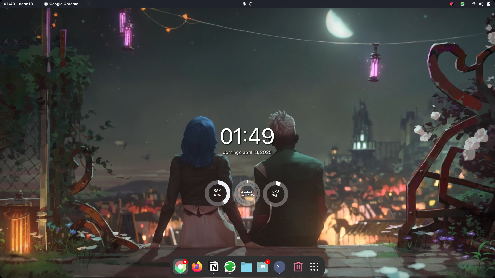
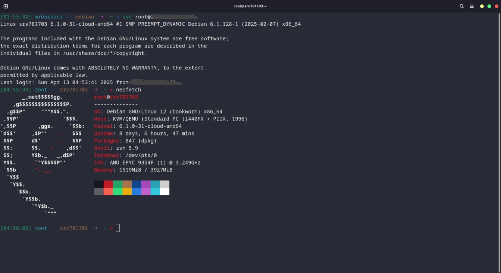

# Debian

# 🧠 **Surgimento do Debian**

O Debian nasceu da frustração com o estado caótico das distribuições Linux no início dos anos 90. Ian Murdock, estudante da Purdue University, observava que:

- As distribuições disponíveis (como **SLS** e **Slackware**) eram **difíceis de manter, mal documentadas e pouco organizadas**.
- A maioria era mantida por **uma ou duas pessoas**, sem controle de qualidade, sem repositórios oficiais ou comunidade ativa.

Ian, então com 20 anos, publicou o **Debian Manifesto**, dizendo que o Debian seria:

- Livre como o Linux e o GNU;
- Mas com **controle rigoroso de qualidade**, **documentação oficial**, e **transparência total**.

O Debian foi, assim, o **primeiro grande projeto de distribuição Linux realmente comunitário**, com um modelo aberto de governança.

---

# 🧭 **Filosofia do Debian: Liberdade, Transparência, Comunidade**

Debian não é apenas um sistema operacional. Ele é uma **filosofia de desenvolvimento**:

## 📜 Contrato Social do Debian

Documento criado em 1997 que declara que o projeto:

- Sempre será 100% livre;
- Devolverá contribuições para a comunidade;
- Nunca esconderá problemas críticos dos usuários.

## 📘 DFSG – Debian Free Software Guidelines

Serve como base para definir se um software pode ou não entrar no repositório **main**. Influenciou diretamente a criação da **Open Source Definition** da OSI.

## 🗳️ Modelo de Governança

- Totalmente democrático: desenvolvedores votam em decisões estratégicas.
- O líder do projeto (**DPL – Debian Project Leader**) muda a cada ano.
- Isso evita a **centralização** e garante diversidade de visão no comando do projeto.

## 🤝 Comunidade

- Desenvolvedores espalhados pelo mundo, todos voluntários (ou patrocinados).
- Mecanismos como **“sponsorship”, “mentorship” e “bug squashing parties”** são comuns.
- Infraestrutura mantida por fundações como **Software in the Public Interest**.

# 🎬 O**s nomes das versões**

A decisão de nomear as versões do Debian com nomes de personagens da franquia **Toy Story**, da Pixar, é uma daquelas histórias que mostram como o software livre também tem alma, memória e até uma certa dose de humor.

## 🔙 **Origem: uma homenagem e uma coincidência pessoal**

O primeiro personagem de Toy Story a ser usado como codinome de uma versão do Debian foi **Buzz**, em **1996**. O nome homenageava o astronauta **Buzz Lightyear**.

Mas o mais interessante é que um dos primeiros desenvolvedores do Debian trabalhava **na Pixar** na época — a mesma empresa responsável por Toy Story. Essa ligação direta entre os bastidores do Debian e os estúdios da Pixar acabou marcando o início de uma tradição que dura até hoje.

Desde então, **cada versão do Debian recebeu o nome de um personagem da franquia Toy Story**. Veja alguns exemplos:

| Versão | Nome | Personagem |
| --- | --- | --- |
| 1.1 | Buzz | Buzz Lightyear |
| 1.2 | Rex | Dinossauro verde |
| 2.0 | Hamm | Porquinho-cofre |
| 3.0 | Woody | Xerife de brinquedo |
| 4.0 | Etch | Quadro mágico |
| 5.0 | Lenny | Binóculo |
| 6.0 | Squeeze | Polvo brinquedo |
| 7.0 | Wheezy | Pinguim de brinquedo |
| 8.0 | Jessie | Vaquerinha |
| 9.0 | Stretch | Polvo roxo |
| 10.0 | Buster | Cachorro do Andy |
| 11.0 | Bullseye | Cavalo do Woody |
| 12.0 | Bookworm | Minhoca leitora do Andy |
| 13.0 (futuro) | Trixie | Tricerátopo azul |

## 🎭 **Por que essa escolha é significativa?**

- **Simbolismo**: Os personagens de Toy Story são brinquedos que ganham vida **por meio da colaboração, amizade e propósito coletivo** — valores que se alinham diretamente à filosofia do Debian e do software livre.
- **Leveza num mundo técnico**: Em meio à complexidade de sistemas operacionais, kernels e pacotes, essa escolha **quebra a rigidez** do ambiente técnico com uma dose de criatividade e humor.
- **Humanização do projeto**: Ao nomear uma versão de sistema operacional com o nome de um personagem querido de um filme infantil, o Debian mostra que por trás das linhas de código há **pessoas, histórias, e afetos**.
- **Continuidade e identidade**: A tradição virou **marca registrada**. Mesmo novas gerações de usuários, ao ouvirem que a nova versão será “Trixie”, sabem que é Debian — é uma identidade mantida por décadas.

## 🧩 Técnicos também são gente

Em projetos de software livres, especialmente os mais sérios e grandes como o Debian, decisões como essa ajudam a manter a coesão da comunidade. Criam **memória afetiva**, reforçam o sentimento de pertencimento e deixam claro que há espaço para cultura e diversão dentro da engenharia de software.

Inclusive, até mesmo a versão instável do sistema segue essa tradição com bom humor:

> A versão Sid, também chamada de Unstable, representa o estágio mais dinâmico do Debian, onde os pacotes recém-introduzidos são constantemente testados antes de avançarem para as versões Testing e Stable — seu nome é uma referência ao garoto que quebra brinquedos em Toy Story, simbolizando o caráter experimental e instável desse ramo.
> 

---

# **Classificação do Debian**

## 🖥️ **Desktop**

- Possui interfaces gráficas populares como **GNOME, KDE Plasma, XFCE, LXQt**, etc.
- Extremamente **estável e seguro**.
- Comparado ao Ubuntu: menos “user-friendly”, mas mais **personalizável e modular**.

## 🌐 **Servidor**

- Usado em **milhões de servidores web**, bancos de dados, containers (Docker), sistemas de automação e mais.
- Está na base de muitas distros focadas em servidor, como o **Proxmox VE** e **TurnKey Linux**.

## 📱 **Mobile / Embedded**

- **Debian é base para distribuições móveis** como Mobian e postmarketOS (Android livre).
- Também usado em **Raspberry Pi**, roteadores, set-top boxes e sistemas embarcados via **Debian ARM**.

## 🏭 **Indústria / Robótica / IoT**

- Empresas usam Debian em **equipamentos industriais, PLCs, impressoras 3D e sistemas SCADA**.
- Suporte a arquiteturas como **ARM, MIPS, RISC-V, PowerPC**, ideal pra dispositivos customizados.

## 🔬 **Ciência e Pesquisa**

- Projetos como o **Large Hadron Collider**, **clústeres da NASA** e universidades no mundo todo usam Debian como base científica.
- Excelente repositório de ferramentas científicas, bibliotecas de álgebra, simulação, bioinformática etc.

---

# **Interface Gráfica (GUI)**

### 🖥️ **GUI**

- Debian oferece uma instalação com ambiente gráfico opcional.
- Interfaces disponíveis:
    - **GNOME (padrão)**
    - **KDE Plasma**
    - **XFCE (leve)**
    - **LXQt (ultraleve)**
    - **MATE (clássico)**

📸 *Exemplo da tela inicial com GNOME:*



---

# 💻 **CLI (modo texto)**

- O Debian também pode ser instalado **sem interface gráfica**, como é comum em servidores.
- Interface CLI utiliza terminal bash ou zsh.
- Instalação mínima ocupa ~600MB e consome menos de 100MB de RAM.

📸 *Exemplo do Debian CLI após login:*



---

# 📦 P**acote `.deb`**

Um **.deb** (abreviação de **Debian Archive**) é um **formato de empacotamento de software** utilizado pelas distribuições baseadas no **Debian**, como Ubuntu, Linux Mint, Kali Linux, Pop!_OS, entre muitas outras.

> Ele é equivalente ao .rpm no Red Hat/Fedora, ao .apk no Alpine, ou até ao .msi no Windows.
> 

Mas diferente de um simples "instalador", o `.deb` **carrega metadados, dependências, scripts de instalação**, e é tratado por ferramentas inteligentes como o APT.

Na época do surgimento do Debian (1993), a maior parte das distribuições Linux **não tinha um sistema formal de empacotamento**. O software era distribuído em **tarballs** (`.tar.gz`), que o usuário extraía e compilava manualmente.

Esse processo era:

- Lento
- Propenso a erros
- Difícil de manter
- Frágil em relação a dependências

Com o crescimento do Debian, surgiu a necessidade de um **formato padronizado e automatizável** para empacotar software — algo que pudesse ser **instalado, atualizado e removido com controle total**.

Assim nasceu o formato `.deb`.

## 🔍 Estrutura interna de um `.deb`

Um pacote `.deb` é um **arquivo ar (Unix Archive)** que contém três partes principais:

```
package.deb
├── debian-binary        → Arquivo de texto com a versão do formato (normalmente “2.0”)
├── control.tar.gz/xz    → Metadados sobre o pacote (nome, versão, dependências, scripts)
├── data.tar.gz/xz       → Arquivos reais do software (executáveis, bibliotecas, configs)
```

### 🧾 control.tar.gz

Contém:

- `control` → Nome, versão, descrição, dependências (`Depends`), conflitos (`Conflicts`)
- `preinst` → Antes da instalação
- `postinst` → Script executado após a instalação
- `prerm` → Script executado antes da remoção
- `postrm` → Script após remoção

### 📂 data.tar.gz

Contém a estrutura real do sistema de arquivos, como:

```bash
/usr/bin/meu_app
/etc/meu_app/config.yml
/var/log/meu_app/
```

O APT, ao instalar, extrai e **coloca esses arquivos nos locais certos**, respeitando permissões, donos, grupos etc.

## 🧠 Por que o `.deb` foi revolucionário?

### 📚 **Modularidade e Organização**

Cada aplicativo, biblioteca ou componente é um `.deb`, com informações detalhadas de:

- Versão
- Arquitetura suportada
- Requisitos mínimos
- Pacotes com os quais **não pode** coexistir

Isso possibilita **controle total do sistema operacional**, sem "gambiarras".

### 🛡️ **Segurança e confiança**

- Cada pacote `.deb` dos repositórios oficiais do Debian é **verificado e assinado criptograficamente**.
- Isso garante que **nenhum software adulterado** seja instalado.

### 🧪 **Scripts automáticos**

Como o `.deb` embute scripts, ele pode configurar serviços automaticamente, iniciar daemons, fazer migrações de dados e muito mais — tudo **sem intervenção do usuário**.

### 📌 Desinstalação simples com `dpkg`

```bash
sudo dpkg -r nome-do-pacote
```

Esse comando **remove o pacote** (binários, bibliotecas, arquivos principais), **mas mantém os arquivos de configuração** que estão em locais como `/etc`.

> Isso é útil se você quiser reinstalar o pacote futuramente sem perder as configurações.
> 

## 🧱 Comparação com outros formatos

| Característica | `.deb` (Debian) | `.rpm` (Red Hat) | `.tar.gz` (manual) |
| --- | --- | --- | --- |
| Geração de dependências | Sim | Sim | Não |
| Scripts automáticos | Sim | Sim | Não |
| Suporte a repositórios | Sim | Sim | Não |
| Assinatura GPG | Sim | Sim | Não |
| Controle de versão | Sim | Sim | Não |
| Reversão automática | Limitado | Limitado | Não |
| Integração com o sistema | Completa | Completa | Manual |

## 📌 `.deb` hoje

O `.deb` continua sendo **o formato dominante no mundo Linux para desktops e servidores**, graças à:

- Popularidade do Debian
- Influência do Ubuntu
- Rico ecossistema de ferramentas (APT, DPKG, GDebi, Synaptic)
- Documentação sólida e comunidade engajada

Muitos projetos ainda empacotam primeiro para `.deb` antes de ir para outros formatos como `.rpm` ou Snap/Flatpak.

## ⚙️ Ferramentas relacionadas ao `.deb`

- `dpkg` → Gerenciador base de pacotes `.deb`
- `apt` / `apt-get` → Interface de alto nível com repositórios
- `gdebi` → Instala pacotes `.deb` baixados manualmente com resolução de dependências
- `lintian` → Verifica se o `.deb` está conforme as boas práticas do Debian
- `debuild` / `dpkg-deb` → Usado para empacotar software em `.deb`

---

# Gerenciador de Pacotes **`dpkg`**

O `dpkg` (**Debian Package**) é a ferramenta de gerenciamento de pacotes de mais baixo nível do Debian. Ele foi criado para instalar, configurar, remover e inspecionar pacotes `.deb`, localmente, sem depender de repositórios ou da internet.

Ele é a primeira camada do sistema de pacotes Debian — o que os comandos mais avançados (como `apt`) usam nos bastidores.

O `dpkg` surgiu nos primeiros anos do Debian (por volta de 1994), como uma resposta à crescente complexidade de manter e instalar software num sistema Unix-like. Na época, os usuários ainda compilavam tudo manualmente — o que exigia um grande conhecimento técnico.

O Debian precisava de uma **ferramenta robusta, confiável e automatizável**, e o `dpkg` foi a primeira a cumprir esse papel.

## 📁 Onde o `dpkg` armazena seus dados?

O `dpkg` mantém um banco de dados próprio no diretório:

```
/var/lib/dpkg/
```

Esse diretório guarda:

- `status`: o estado de todos os pacotes instalados (instalado, removido, quebrado, etc.)
- `info/`: onde estão arquivos de controle e scripts de cada pacote instalado (como `postinst`, `prerm`, etc.)
- `available`: pacotes conhecidos (caso você utilize ferramentas auxiliares baseadas no dpkg)

## 📦 Estrutura de funcionamento do `dpkg`

1. **Verifica a integridade do pacote**
2. **Extrai arquivos para os diretórios corretos**
3. **Executa scripts de instalação (pré e pós)**
4. **Registra o pacote no banco de dados**
5. **Mantém rastreamento de arquivos e permissões**

**Exemplo de instalação**:

```bash
dpkg -i nome_do_pacote.deb
```

**Exemplo de remoção (sem configs):**

```bash
dpkg -r nome_do_pacote
```

**Remoção completa (com arquivos de configuração):**

```bash
dpkg -P nome_do_pacote
```

## 🔍 Recursos técnicos interessantes do `dpkg`

- Permite saber **quais arquivos pertencem a qual pacote**:

```bash
dpkg -L nome_do_pacote
```

- Permite saber **a qual pacote pertence um arquivo do sistema**:

```bash
dpkg -S /usr/bin/python3
```

- Detecta pacotes quebrados:

```bash
dpkg -C
```

- Reconfigura pacotes parcialmente instalados:

```bash
dpkg --configure -a
```

## 🏗️ Importância do `dpkg`

O `dpkg` foi um **divisor de águas** no mundo Linux por trazer os seguintes conceitos pioneiros:

- Instalação **não-interativa**, usando scripts internos ao pacote
- Registro formal dos arquivos instalados
- **Desinstalação limpa**, sem deixar lixo no sistema
- Armazenamento do estado dos pacotes
- Separação entre arquivos binários, arquivos de configuração e metadados

Esses pontos tornaram o Debian **pioneiro na padronização da instalação de software** no Linux.

---

# 🔧 Repositório APT

O **APT (Advanced Package Tool)** é um conjunto de ferramentas criado pelos desenvolvedores do Debian para **gerenciar pacotes de software `.deb`**, resolvendo automaticamente todas as **dependências**, instalando, removendo, atualizando e mantendo o sistema de forma segura e eficiente.

Antes do APT, mesmo em sistemas baseados em pacotes como o Debian e o Slackware, **instalar software era um verdadeiro caos**:

- O comando `dpkg` (Debian Package) era usado para instalar pacotes `.deb`, mas ele **não resolvia dependências**. Você precisava instalar cada pacote **manualmente**, um por um.
- Muitas vezes, os usuários baixavam um `.deb` de algum site e, ao tentar instalar, se deparavam com mensagens como:
    
    ```bash
    Error: missing dependency libxyz.so
    ```
    
- Isso iniciava a famosa **“dependência infernal”** ou *dependency hell*, onde cada pacote exigia outro, que por sua vez exigia mais, e às vezes **não eram nem compatíveis entre si**.
    
    
    A equipe do Debian, liderada por **Jason Gunthorpe** e **Ben Collins**, percebeu que **sem um sistema inteligente de gerenciamento de pacotes**, o crescimento do sistema se tornaria impossível.
    
    Assim nasceu, em **1998**, o **APT**, que foi:
    
    ✅ O **primeiro gerenciador de pacotes com resolução automática de dependências.**
    
    ✅ O **primeiro a permitir atualização do sistema inteiro com um só comando (`apt upgrade`).**
    
    ✅ O primeiro a combinar **repositórios remotos com verificação de integridade**.
    

## ⚙️ Estrutura Técnica do APT

O APT é composto por várias partes que trabalham em conjunto:

### 🏗️ Backend

- **`libapt-pkg`**: Biblioteca C++ que contém toda a lógica para resolver dependências, gerenciar versões e buscar pacotes.
- **`apt-get`**: Utilitário tradicional de linha de comando que usa a `libapt-pkg`.
- **`apt-cache`**: Usado para consultar informações locais sobre pacotes (versão, dependências, descrição etc).
- **`apt`** (comando mais novo): Interface mais amigável que substitui `apt-get`, `apt-cache` e outros, com melhor feedback visual.

### 📦 Fontes de Pacotes

- Definidas no arquivo `/etc/apt/sources.list`.
- Podem apontar para:
    - Servidores HTTP/HTTPS
    - Espelhos locais
    - Repositórios em CD/DVD
    - Repositórios personalizados (como o do Google Chrome, Spotify, etc.)

### 🔒 Segurança

- Todos os pacotes são assinados com **GPG**.
- O APT verifica a **assinatura digital dos repositórios** antes de instalar qualquer coisa, garantindo autenticidade e integridade.

## 🌍 Por que o APT foi tão importante?

### 💣 Acabou com o "inferno das dependências"

Antes do APT, instalar um software em Linux podia significar horas tentando descobrir o que faltava. O APT simplesmente faz isso sozinho, e **te avisa se algo vai quebrar**.

### ⚡ Atualizações atômicas

Com o APT, pela primeira vez, era possível rodar comandos como:

```bash
sudo apt update
sudo apt upgrade
```

E seu sistema era atualizado de forma **segura, confiável e completa**. Isso mudou tudo.

### 🧼 **Desinstalação limpa**

A estrutura dos scripts também garante que o `.deb` possa ser **removido de forma completa**, inclusive seus arquivos de configuração e dependências não utilizadas:

```bash
sudo apt remove nome
sudo apt purge nome
sudo apt autoremove
```

### 🧬 Base para outros gerenciadores

O modelo do APT inspirou (e continua inspirando) quase todos os gerenciadores modernos:

| Sistema | Gerenciador | Inspirado no APT? |
| --- | --- | --- |
| Ubuntu | `apt` e `snap` | Diretamente baseado |
| Linux Mint | `apt` + `mintinstall` | Sim |
| Kali Linux | `apt` | Sim |
| Arch Linux | `pacman` | Conceito semelhante, mas não usa `.deb` |
| Fedora | `dnf` | Modelo próprio, mas similar |
| openSUSE | `zypper` | Modelo paralelo |

### 🏛️ Infraestrutura de repositórios organizada

O APT popularizou o conceito de **repositórios centralizados e auditáveis**, onde tudo é controlado pela comunidade, sem depender de fontes externas obscuras.

## 💎 Funcionalidades avançadas do APT que muita gente não conhece:

| Ferramenta/Comando | Função |
| --- | --- |
| `apt-mark hold` | Impede que um pacote seja atualizado |
| `apt list --upgradable` | Mostra tudo o que pode ser atualizado |
| `apt-cache rdepends` | Mostra quem **depende** de um pacote |
| `apt-get build-dep` | Instala todas as dependências necessárias para compilar um pacote |
| `apt-file search` | Procura em qual pacote está um determinado **arquivo do sistema** |
| `apt-key` (agora obsoleto) | Gerenciava chaves GPG de repositórios |

## 🧠 Reflexão Final

O APT não foi só uma inovação técnica. Ele moldou a forma como **pensamos, usamos e confiamos nos pacotes em sistemas Linux**. Foi uma resposta comunitária e engenhosa a um problema real, e ainda hoje é referência de estabilidade e boa arquitetura de software.

---

# 🧰 **Vantagens**

| Vantagem | Explicação Técnica | Comparações |
| --- | --- | --- |
| 🧱 **Estabilidade Extrema** | A versão "Stable" do Debian passa por um ciclo rigoroso de testes, chamado de "testing freeze", onde os pacotes só entram após meses de verificação de bugs críticos. | Fedora e Arch têm atualizações rápidas, mas podem quebrar. |
| 🔧 **Suporte total ao hardware básico (atalhos, teclas especiais)** | Ao contrário de Ubuntu/Mint (que exigem drivers extras), o Debian **detecta corretamente as ACPI keys** (volume, brilho) em muitos laptops sem precisar de ajustes. Isso ocorre porque a equipe mantém patches próprios no kernel e nos pacotes `udev` e `acpid`. | Ubuntu e Mint, apesar de "user-friendly", pecam nessa parte e exigem configuração manual com `xbindkeys`, `brightnessctl`, ou scripts. |
| 🧩 **Modularidade total** | Você pode instalar um Debian sem NADA (só a base), e construir o sistema do zero — interface gráfica, servidor, apps — só com o que quiser. Nenhum pacote é forçado. | Ubuntu e Mint já vêm com muitos apps por padrão. |
| 🔁 **APT e gerenciamento de pacotes impecável** | O `APT` é eficiente, seguro e maduro. O Debian **foi o primeiro** a implementar um sistema de resolução de dependências confiável. Possui também o `apt-listbugs` e o `apt-listchanges`, que alertam antes de instalar atualizações problemáticas. | Arch usa `pacman`, rápido, mas com menos suporte a rollback. |
| 🔐 **Transparência e segurança total** | Todos os pacotes são **verificados, auditáveis, e reproduzíveis**. Pacotes `.deb` podem ser reconstruídos com o mesmo checksum se recompilados. | Ubuntu não segue 100% de reprodutibilidade. |
| 💬 **Comunidade madura e com foco em estabilidade** | Fóruns, listas de e-mails e canais IRC cheios de devs experientes, com foco em engenharia de software — não só em “usuário final”. | Fedora tem boa comunidade, mas com foco em tecnologia de ponta, não estabilidade. |
| 🌍 **Portabilidade entre arquiteturas** | Debian funciona em x86, x86_64, ARM, RISC-V, MIPS, PowerPC, SPARC, s390x… Muitos desses abandonados por outras distros. | Ubuntu abandonou suporte a 32-bit completo, e Arch tem foco quase exclusivo em x86_64. |
| 🧪 **Repositório Experimental + Backports + LTS** | Além do “stable”, o Debian oferece o “testing”, “unstable (sid)”, “experimental” e “backports”. Isso permite escolher entre estabilidade e novidade de forma granular. | Fedora tem “rawhide”, mas com menos flexibilidade. |

---

# 🧨 **Desvantagens e Limitações Técnicas**

| Limitação | Explicação Técnica | Comparação com Outros |
| --- | --- | --- |
| 📦 Software desatualizado no “Stable” | O ciclo de desenvolvimento do Debian é lento por natureza. O kernel, por exemplo, pode estar 2 versões atrás. Para bibliotecas modernas (como PyTorch, TensorFlow, etc.), isso pode ser um entrave. | Arch e Fedora trazem as últimas versões, com risco de instabilidade. |
| 🧠 Curva de aprendizado mais alta | Não há assistentes gráficos por padrão. Instalar pacotes exige conhecimento de `apt`, `systemd`, permissões etc. | Ubuntu e Mint têm interfaces gráficas para instalar drivers, pacotes, updates. |
| 📺 Suporte gráfico deficiente em GPUs NVIDIA proprietárias | É necessário ativar o repositório `non-free`, instalar o `nvidia-driver`, fazer ajustes no GRUB e `xorg.conf`. | Ubuntu detecta e instala automaticamente o driver proprietário. |
| 🎮 Jogos e suporte a mídia proprietária | O Debian não traz codecs proprietários, Steam, ou firmware de placas Wi-Fi Realtek por padrão. É necessário habilitar `non-free-firmware`. | SteamOS, Mint e Ubuntu trazem esses pacotes pré-instalados. |
| 📡 Atualizações lentas de software científico | Programas como QGIS, GROMACS, Octave, às vezes estão defasados na stable. Para usá-los atualizados, é preciso usar `backports` ou compilar. | Fedora é mais alinhado com releases recentes da comunidade científica. |

---

# 🌱 Forks do Debian: A multiplicação da filosofia

Desde sua criação em 1993, o Debian se destacou por ser **livre, comunitário, altamente estável e comprometido com padrões abertos**. Essas qualidades tornaram o projeto **base confiável para o surgimento de muitas outras distribuições** — verdadeiros *forks*, que nascem a partir do código-fonte e estrutura do Debian, mas seguem rumos próprios.

## 🧾 Por que ocorrem forks?

Forks do Debian geralmente surgem por três motivos principais:

1. **Objetivos diferentes:** desejam atender públicos ou necessidades específicas (educação, segurança, ciência, etc.)
2. **Filosofia distinta:** querem modificar ou relaxar regras do Debian, como licenciamento ou ciclos de lançamento.
3. **Rapidez de desenvolvimento:** preferem ciclos mais ágeis ou mudanças tecnológicas mais ousadas.

## 🌟 Exemplos notáveis de forks

### 📦 **Devuan (2014 - atual)**

**Motivação:** Discordância da adoção do `systemd` como init padrão no Debian 8 (Jessie).

**Foco:** Manter o Debian **sem `systemd`**, utilizando alternativas como `sysvinit`, `OpenRC` ou `runit`.

**Características herdadas:**

- Usa os mesmos pacotes `.deb` e `dpkg`
- Mantém a estrutura de repositórios e ferramentas APT
- Suporte a arquiteturas amplas (x86, ARM, etc.)

**Importância:**

- Tornou-se o porto seguro de sysadmins e usuários que preferem liberdade na escolha do sistema de inicialização
- Influenciou o debate sobre modularidade no ecossistema Linux

### 🧑‍🏫 **Skolelinux / Debian Edu**

**Motivação:** Criar uma distribuição Debian voltada para **ambientes escolares e educacionais**, especialmente na Europa.

**Foco:** Pré-configuração de ambientes de rede, servidores educacionais, e suporte a hardware antigo.

**Características herdadas:**

- 100% compatível com Debian Stable
- Usa o mesmo instalador do Debian, com opções educacionais ativadas
- Interface leve e amigável, geralmente com KDE ou LXDE

**Importância:**

- Amplamente usado em escolas públicas da Noruega e Alemanha
- É um **projeto oficial do Debian**, portanto tecnicamente não é um fork externo, mas sim um *derivado interno*

### 🧪 **PureOS**

**Motivação:** Criado pela empresa Purism com foco em **privacidade, segurança e software 100% livre** (sem blobs, drivers ou firmware proprietário).

**Foco:** Fornecer um sistema operacional para os laptops Librem e o smartphone Librem 5.

**Características herdadas:**

- Baseado no Debian Testing/Stable
- Utiliza `.deb`, `dpkg`, `APT`, etc.
- Usa GNOME com modificações para privacidade

**Importância:**

- Reconhecido pela Free Software Foundation como uma das poucas distros 100% livres
- Adotado como base para projetos de segurança e privacidade digital

### 🧮 **CrunchBang (#!)** *(descontinuado, mas relevante)*

**Motivação:** Oferecer um Debian ultraleve com Openbox, focado em desempenho e simplicidade.

**Foco:** Usuários avançados e hardware modesto.

**Características herdadas:**

- Baseado em Debian Stable
- Totalmente compatível com pacotes `.deb`
- Ambientes minimalistas prontos para uso com pouca memória

**Importância:**

- Influenciou distros posteriores como BunsenLabs (que continua seu legado)
- Tornou Debian acessível a usuários com PCs antigos

### 🟣 **Ubuntu: o fork mais popular do Debian**

- 🧬 **Surgimento e objetivo**
    - Criado em **2004** por **Mark Shuttleworth** e mantido pela **Canonical Ltd.**
    - Baseado no **Debian Testing**, com o objetivo de tornar o Linux mais **acessível, amigável e com lançamentos previsíveis**.
    - Nome "Ubuntu" vem de um conceito africano que significa
        
        > **eu sou porque nós somos**
        > 
        
         reforçando a proposta comunitária.
        
- ⚙️ **Relação técnica com o Debian**
    - Compartilha o sistema de pacotes: `.deb`, `dpkg`, `APT`
    - Sincroniza pacotes do Debian, mas implementa **melhorias visuais e práticas**
    - Foco em **facilidade de uso**, com instalação gráfica e reconhecimento automático de hardware
- 📆 **Lançamentos**
    - Ciclo fixo: **lançamentos a cada 6 meses**
    - Versões LTS (Long Term Support) a cada 2 anos, com **5 anos de suporte**
    - Ideal para empresas e ambientes que buscam estabilidade com previsibilidade
- 🖥️ **Público-alvo e usabilidade**
    - Voltado para **usuários iniciantes, ambientes corporativos e nuvem**
    - Interface GNOME (anteriormente Unity), pronta para uso
    - Possui edições especializadas: Ubuntu Server, Ubuntu Core, entre outros
- 🔍 **Comparação com Debian**
    
    
    | Característica | Debian | Ubuntu |
    | --- | --- | --- |
    | Lançamento | Irregular ("quando pronto") | Fixo (abril e outubro) |
    | Estabilidade | Extremamente alta | Alta, com foco em atualizações |
    | Suporte corporativo | Não oficial | Canonical (profissional) |
    | Facilidade de uso | Menos amigável por padrão | Pronto para uso no desktop |
- 🔄 **Influência reversa**
    
    Mesmo sendo um fork, o Ubuntu também influenciou o Debian em pontos como:
    
    - Instalador gráfico mais intuitivo
    - Suporte facilitado a firmwares não-livres (ISOs com *non-free*)
    - Estrutura para sistemas live
